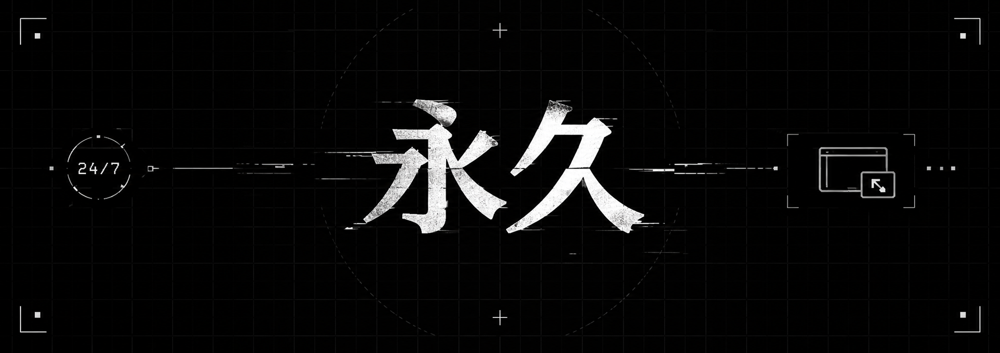

<p align="center">
  
</p>

<h1 align="center">Towa 永久</h1>

<p align="center">
  <em>Um bot de Discord que fica na sua call — para sempre.</em>
</p>

<p align="center">
  <a href="README.md">🇺🇸 English</a> ·
  <a href="README.pt-BR.md">🇧🇷 Português</a>
</p>

<p align="center">
  
  
  
  
  
</p>

---

**Towa** (永久, *"eternidade"* em japonês) entra no canal de voz que você escolher e nunca sai.
Ele não toca nada — só fica conectado, 24/7. Se for kickado, movido ou desconectado, volta na hora.

## ✨ Funcionalidades

- 🔁 **Reconexão automática** — volta após kicks, movimentações, quedas de rede e reconexões do gateway, com backoff exponencial.
- 🩺 **Watchdog** — verifica periodicamente todos os servidores e corrige qualquer desvio.
- 🔐 **Configuração só para admins** — apenas administradores do servidor (ou um usuário definido no env) alteram as configurações.
- 💾 **Persistente** — configuração por servidor em SQLite, restaurada ao reiniciar.
- ⚡ **Slash commands** — registrados por servidor ao iniciar, sobrescrevendo comandos antigos.
- 🎭 **Presença configurável** — status e atividade definidos pelo ambiente.
- 📜 **Logs estruturados** — JSON (pino) em produção, logs legíveis em desenvolvimento.
- 🐳 **Imagem Docker enxuta** — compilado num binário único sobre Alpine.

## 🧭 Comandos

| Comando | Descrição | Permissão |
| --- | --- | --- |
| `/voice set canal:<canal>` | Define o canal de voz e entra nele | Admin |
| `/voice leave` | Sai do canal e desativa o 24/7 | Admin |
| `/voice status` | Mostra a configuração atual | Todos |

> "Admin" é quem tem a permissão **Administrador** no servidor, ou o usuário definido em `ADMIN_USER_ID`.

## 🚀 Começando

### 1. Crie o bot

1. Crie uma aplicação no [Discord Developer Portal](https://discord.com/developers/applications) e copie o **token do bot**.
2. Convide-o com os escopos `bot` e `applications.commands` e as permissões **Ver Canal** e **Conectar**.

### 2. Configure

```sh
cp .env.example .env
```

| Variável | Padrão | Descrição |
| --- | --- | --- |
| `DISCORD_TOKEN` | — | **Obrigatório.** Token do bot |
| `ADMIN_USER_ID` | — | Usuário que pode alterar configurações sem ser Administrador |
| `BOT_STATUS` | `online` | `online` · `idle` · `dnd` · `invisible` |
| `ACTIVITY_TYPE` | `custom` | `playing` · `streaming` · `listening` · `watching` · `competing` · `custom` |
| `ACTIVITY_NAME` | — | Texto da atividade (vazio = sem atividade) |
| `ACTIVITY_URL` | — | URL da Twitch/YouTube, obrigatória para `streaming` |
| `DATABASE_PATH` | `data/bot.sqlite` | Caminho do arquivo SQLite |
| `LOG_LEVEL` | `info` | `trace` · `debug` · `info` · `warn` · `error` · `fatal` |
| `LOG_PRETTY` | `true` em dev | Logs legíveis em vez de JSON |
| `RECONNECT_DELAY_MS` | `5000` | Atraso base do backoff de reconexão |
| `CONNECT_TIMEOUT_MS` | `20000` | Tempo máximo esperando a conexão de voz |
| `WATCHDOG_INTERVAL_MS` | `60000` | Intervalo da verificação periódica |

Todas as variáveis são validadas ao iniciar. Valores inválidos impedem o bot de subir, com uma mensagem de erro clara.

### 3. Rode

**Com Docker (recomendado)**

```sh
docker compose up -d --build
docker compose logs -f
```

**Com Bun**

```sh
bun install
bun dev     # modo watch, logs legíveis
bun start   # execução normal
```

## 🗂️ Estrutura do projeto

```
src/
├── index.ts              # inicialização e encerramento gracioso
├── config.ts             # env tipado e validado (zod)
├── logger.ts             # logs estruturados (pino)
├── db.ts                 # persistência SQLite (bun:sqlite)
├── voice/manager.ts      # ciclo de vida da conexão, reconexão e watchdog
├── commands/             # slash commands, permissões e registro
└── events/               # handlers de eventos do Discord
```
